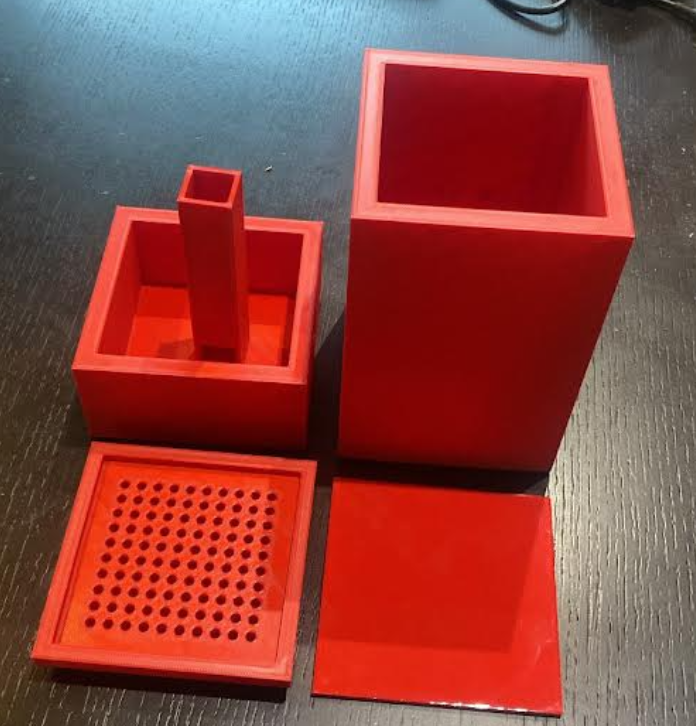

# Portable Garden

A team-built automated portable spinach garden on a **Raspberry Pi Pico** (MicroPython), with STEMMA soil sensing, an LDR for ambient light, transistor-driven grow lights, and a water pump. Documented from the group logbook (February 2025–2026 build notes).

**Category:** Electronics / Embedded Systems  
**Status:** Completed  
**Logbook:** [documentation/portable_garden_Logbook.pdf](documentation/portable_garden_Logbook.pdf)

---

## Hero image



---

## Overview

The goal was a compact, portable growing system for spinach with automated watering and supplemental lighting. The enclosure uses 3D-printed walls/roof, a polyethylene base, a bottle-style plant holder, and a printed showerhead. Electronics live on a breadboard with a Pico controlling:

- **STEMMA soil sensor** (moisture + temperature over I2C)
- **Photoresistor (LDR)** for darkness detection
- **Grow lights** (GPIO → transistor)
- **Water pump** (GPIO → transistor, 5 V supply with series potentiometer for flow)

Plant targets from logbook research: full sun to partial shade (≈3–4 hours direct light), organically rich moist soil, frequent moderate watering (~139.7 mm/week equivalent guidance), and roughly **10–15 °C**.

---

## Project status

| Milestone | Status | Notes |
|-----------|--------|-------|
| Materials + pin map + spinach research | Done | Feb 7 |
| First soil / light / pump sketches | Done | Feb 7 |
| LDR integrated with grow lights | Done | Feb 10 |
| Code bench tests + dimension updates | Done | Feb 13–14 |
| Finalized firmware + assembly | Done | Feb 21 |
| Presentation + project complete | Done | Feb 25–26 |

---

## My role

Team project — update with your personal contributions (CAD, firmware, sensors, assembly, presentation).

---

## Features

### Implemented

- I2C STEMMA soil moisture + temperature monitoring
- LDR-based grow-light control (up to 4 hours supplemental light per 24-hour window when dark)
- Pump watering for 3 seconds when soil is very dry (moisture ≤ 450)
- 3D-printed mechanical parts (shell, tray, center-tube base, plate / showerhead area)
- Breadboard electronics housing for sensors and drivers

### Planned / follow-ups

- Commit CAD STEP/STL sources under `cad/`
- Add schematic drawings under `schematics/` if available
- Record calibrated LDR and moisture thresholds from real plants

---

## Hardware

| Component | Purpose | Pins / notes |
|-----------|---------|--------------|
| Raspberry Pi Pico | Controller (MicroPython) | — |
| STEMMA soil sensor | Moisture + temp | SDA 4, SCL 5 |
| LDR (photoresistor) | Ambient light | ADC 28 |
| Grow LEDs + transistor | Supplemental lighting | GPIO 15 |
| Pump + transistor + pot | Irrigation flow | GPIO 16; pot sets flow |
| 3D-printed enclosure / showerhead | Structure + watering head | See images |
| Bottle / pipe plant holder + coffee filters | Growing medium support | Bottle ≈ 225 mm (Feb 14) |
| Polyethylene base | Box floor | Box ≈ 145 mm (Feb 14) |

Full materials list: [bom/bom.md](bom/bom.md)

---

## Software

- **Language:** MicroPython on Raspberry Pi Pico  
- **Libraries:** `stemma_soil_sensor`, `seesaw` (copy onto Pico)  
- **Source:** [code/main.py](code/main.py) (final), [code/main_feb10_draft.py](code/main_feb10_draft.py) (earlier draft)  
- Details: [code/README.md](code/README.md)

### Moisture logic (`main.py`)

| Condition | Moisture reading | Action |
|-----------|------------------|--------|
| Optimal | > 950 | Pump off; long delay |
| Dry | ≤ 950 and > 450 | Pump off; water later |
| Very dry | ≤ 450 | Pump on 3 s, then off |

Datasheet context from logbook: ~200 very dry → ~2000 very wet.

---

## Design tools

- **3D printing** — enclosure, showerhead, and modular prototype parts  
- **MicroPython / Raspberry Pi Pico** — control firmware  
- CAD source tool: TODO (add Fusion 360 / SolidWorks files to `cad/` when available)

---

## System architecture

```text
                    ┌─────────────────┐
   LDR (GP28) ─────►│                 │────► Grow lights (GP15 → transistor)
                    │  Pi Pico        │
 STEMMA I2C         │  MicroPython    │────► Pump (GP16 → transistor → 5 V)
  SDA4 / SCL5 ─────►│                 │
                    └─────────────────┘
                              │
                              ▼
              Soil moisture + temperature
                              │
                              ▼
                 Plant holder / soil / water store
```

---

## Electrical design

- Soil sensor on I2C0 (GPIO 4 / 5)
- Grow light and pump each driven from a GPIO through a transistor
- Pump powered from Pico 5 V with a series potentiometer for flow control
- Schematics: add exports under [schematics/](schematics/) when available
- BOM: [bom/bom.md](bom/bom.md)

---

## Software design

Main loop in [code/main.py](code/main.py):

1. Read LDR and STEMMA moisture/temperature  
2. Reset daily light timer every 24 hours  
3. If dark and lights off → turn lights on and start 4-hour timer  
4. If lights have been on ≥ 4 hours → turn off  
5. Classify moisture and run/stop pump  
6. Short CPU delay, repeat  

---

## Development process

1. Feb 7 — Finalized plan, materials, spinach research, initial code flowchart and sketches  
2. Feb 10 — Added photoresistor; merged light + soil + pump behaviour  
3. Feb 13–14 — Tested code; recorded prototype dimensions (box 145 mm, bottle 225 mm)  
4. Feb 21 — Finalized firmware comments; assembled components; presentation prep  
5. Feb 25–26 — Full assembly; finished presentation; project complete  

---

## Testing and results

See [test-results/notes.md](test-results/notes.md). Logbook records code bench tests (Feb 13) and final integration (Feb 21–26). Add measured values here when available.

---

## Documentation

| File | Description |
|------|-------------|
| [documentation/portable_garden_Logbook.pdf](documentation/portable_garden_Logbook.pdf) | Full group logbook |
| [documentation/group-logbook-prototype-photo.png](documentation/group-logbook-prototype-photo.png) | Prototype printed parts photo |
| [images/prototype-printed-parts.png](images/prototype-printed-parts.png) | Hero image |

---

## Repository structure

```text
portable-garden/
├── README.md
├── code/
│   ├── README.md
│   ├── main.py                 # Final firmware (Feb 21)
│   └── main_feb10_draft.py     # Earlier draft
├── schematics/
├── pcb/
├── cad/
├── documentation/
│   ├── portable_garden_Logbook.pdf
│   └── group-logbook-prototype-photo.png
├── images/
│   └── prototype-printed-parts.png
├── videos/
├── bom/
│   └── bom.md
└── test-results/
    └── notes.md
```

---

## Future improvements

- Export and commit CAD / STL files  
- Draw and commit wiring schematics  
- Calibrate `LDR_MAX` and moisture thresholds on real plants  
- Replace long `time.sleep(100)` blocking delays with non-blocking timing if needed  

---

## Safety and limitations

- Prototype / student project — not a commercial grow system  
- Confirm materials are plant-safe before edible harvest  
- Watch for leaks from 3D-printed water paths  
- Pump and lights are transistor-switched loads — verify wiring before powering  

---

## Acknowledgements

Group project — credit teammates by name only with their permission.

---

## License

Rights reserved unless a root repository license applies.
