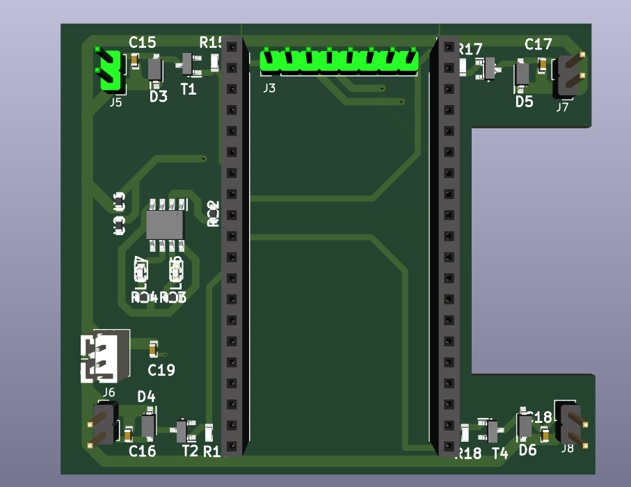
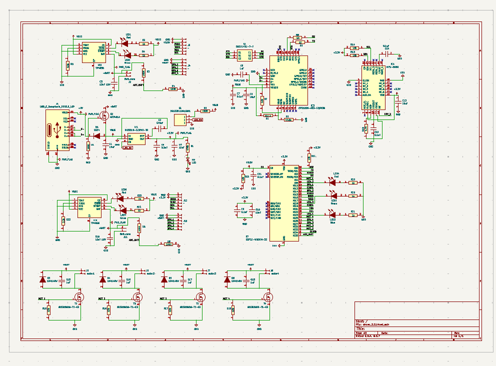
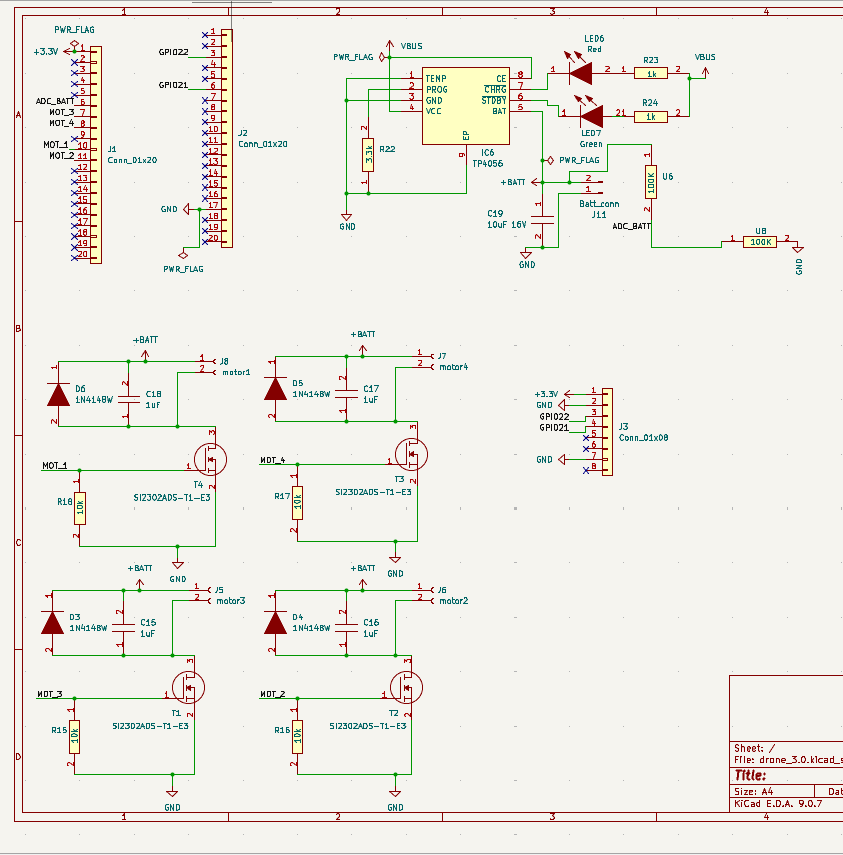

# ESP32-Based Quadcopter Drone

A custom-built quadcopter drone controlled by an ESP32 microcontroller, with four brushed coreless motors, MPU6050-based stabilization, and LiPo power management.

**Category:** Embedded Systems / Power Electronics  
**Status:** In progress

---

## Hero image



---

## Overview

This project is a custom-built quadcopter drone controlled by an ESP32 microcontroller. The drone uses four brushed coreless motors, each driven by a separate MOSFET motor driver circuit. Instead of powering the motors directly from the ESP32, the ESP32 outputs PWM signals to the MOSFET gates, allowing each motor's speed to be controlled independently. This is necessary for lift, stabilization, turning, and directional movement.

The drone uses an MPU6050 inertial measurement unit to measure acceleration and angular rotation. The ESP32 reads this sensor through the I2C communication protocol using the SDA and SCL lines. The sensor data allows the drone to estimate its roll and pitch angles, which are then used to adjust the motor speeds and help stabilize the drone during movement.

Power is supplied by a single-cell 3.7 V LiPo battery. The battery powers the motors directly through the motor driver circuits, while the ESP32 and sensors use regulated low-voltage power. A battery voltage measurement circuit uses a voltage divider to safely reduce the battery voltage before sending it to an ESP32 ADC pin. This allows the ESP32 to monitor battery level without exposing the ADC pin to unsafe voltage levels.

The design also includes a TP4056 LiPo charging circuit, which charges the single-cell battery from USB power. Charging status LEDs indicate whether the battery is charging or fully charged. The overall circuit is based on a modular drone schematic containing motor drivers, battery charging, voltage measurement, ESP32 control, and MPU6050 stabilization sections.

---

## Project status

| Milestone | Status | Notes |
|-----------|--------|-------|
| Motor driver circuits | Done | Four N-channel MOSFET low-side drivers with flyback diodes |
| MPU6050 I2C integration | Done | Roll/pitch angle estimation in firmware |
| Battery voltage monitoring | Done | Voltage divider on ESP32 ADC |
| TP4056 charging circuit | Done | USB charging with status LEDs |
| PCB design | Done | KiCad layout with ESP32, IMU, and motor driver sections |
| Stabilization firmware | In progress | Complementary filter and P-only control loop |
| Frame and flight testing | Planned | Lightweight 3D-printed frame |

---

## My role

Personal project — I designed the electronics, laid out the PCB, wrote the firmware, and bench-tested each subsystem before integration.

- Designed four N-channel MOSFET low-side motor driver circuits with flyback protection.
- Designed battery charging, voltage regulation, and ADC voltage-divider monitoring.
- Laid out the PCB in KiCad and integrated ESP32, MPU6050, and motor driver sections.
- Developed ESP32 firmware for PWM motor control, IMU reading, and basic stabilization.
- Bench-tested motor control, battery measurement, and IMU communication separately before full integration.

---

## Features

### Implemented

- ESP32-based drone control system using four independently controlled motor driver circuits.
- PWM signals from the ESP32 to control brushed coreless motor speed through N-channel MOSFETs.
- MPU6050 gyroscope/accelerometer module for motion sensing and stabilization.
- Battery voltage divider circuit to monitor LiPo battery voltage safely through the ESP32 ADC.
- TP4056 charging circuit for single-cell LiPo battery charging with status LEDs.
- Firmware structure for motor control, sensor reading, and basic stabilization logic.

### Planned

- Lightweight 3D-printed frame assembly and tethered flight testing.
- Wireless control (Bluetooth or radio link).
- Tuning of stabilization gains and full closed-loop flight validation.

---

## Hardware

| Component | Purpose | Notes |
|-----------|---------|-------|
| ESP32-WROOM-32 | Flight controller | PWM outputs, I2C, ADC |
| MPU6050 | IMU | Roll/pitch sensing via I2C |
| SI2302 N-channel MOSFETs (×4) | Motor drivers | Low-side switching with flyback diodes |
| Brushed coreless motors (×4) | Propulsion | Independently PWM-controlled |
| TP4056 | LiPo charger | USB input, charging status LEDs |
| AP2112K-3.3 V LDO | Voltage regulation | 3.3 V rail for ESP32 and sensors |
| 100 kΩ voltage divider (×2) | Battery monitoring | Scales battery voltage for ADC |
| Single-cell 3.7 V LiPo | Power source | Direct motor supply + regulated logic rail |

---

## Software

- **Language / toolchain:** C++ (Arduino framework) on ESP32
- **Libraries:** Adafruit MPU6050, Adafruit Unified Sensor, Wire (I2C)
- **Source:** [code/esp32_drone_test.ino](code/esp32_drone_test.ino)
- **Flash / build:** Arduino IDE or PlatformIO with ESP32 board support

---

## Design tools

- **KiCad 6** — schematic capture and PCB layout (`drone_2.0`, `drone_3.0`)
- **Autodesk Fusion 360** — mechanical frame design (planned)

---

## System architecture

```text
                    ┌─────────────────┐
   USB ────────────►│  TP4056 Charger │──► LiPo Battery ──► Motor drivers (×4)
                    └─────────────────┘         │
                                                ├──► Voltage divider ──► ESP32 ADC
                                                └──► 3.3 V LDO ──► ESP32 + MPU6050

   ESP32 ──PWM──► MOSFET gates (×4) ──► Brushed motors (×4)
   ESP32 ──I2C──► MPU6050 (roll/pitch)
```

---

## Electrical design

The circuit is organized into modular sections: motor drivers, battery charging, voltage measurement, ESP32 control, and MPU6050 stabilization.

- Schematics: see [schematics/](schematics/)
- PCB: see [pcb/](pcb/)
- BOM: see [bom/](bom/)

### Schematic — full system



### Schematic — ESP32 headers and motor drivers



### PCB — 3D render


---

## Software design

Firmware in [code/esp32_drone_test.ino](code/esp32_drone_test.ino) runs a ~50 Hz control loop:

1. **Serial commands** — arm/disarm motors and adjust throttle via USB serial.
2. **IMU reading** — MPU6050 accelerometer and gyro data over I2C.
3. **Angle estimation** — complementary filter fuses accelerometer and gyro for roll/pitch.
4. **Stabilization** — P-only controller computes roll/pitch corrections from angle error.
5. **Motor mixing** — base throttle plus roll/pitch corrections distributed across four motors.
6. **Battery monitoring** — ADC reads divided battery voltage for debug output.

---

## Development process

1. Designed and breadboarded individual MOSFET motor driver circuits.
2. Verified PWM motor control, MPU6050 I2C communication, and ADC battery reading separately.
3. Captured full system schematic in KiCad and laid out the PCB.
4. Integrated subsystems and developed stabilization firmware on the ESP32.

---

## Challenges and debugging

TODO: Document real debugging stories as they are resolved. Use this structure for each issue:

### Issue: TODO title

- **Problem:** TODO
- **Expected behaviour:** TODO
- **How it was tested:** TODO
- **What failed:** TODO
- **What changed:** TODO
- **What was learned:** TODO

---

## Testing and results

Subsystems were bench-tested individually before full integration. Record detailed outcomes in [test-results/](test-results/).

| Test | Method | Result | Date |
|------|--------|--------|------|
| Motor PWM control | Serial throttle commands, propellers removed | All four motors respond independently | TODO |
| MPU6050 communication | I2C scan and serial angle output | Sensor detected, roll/pitch readable | TODO |
| Battery voltage ADC | Serial debug print vs multimeter | Voltage divider output within expected range | TODO |
| Stabilization loop | Bench test with motors armed, no props | Motors adjust based on tilt angle | TODO |

Photos, logs, and notes belong in test-results/ and images/.

---

## Repository structure

```text
personal-drone/
├── README.md
├── code/              # Firmware and application source
├── schematics/        # Schematic sources and exports
├── pcb/               # PCB layout, Gerbers, fabrication outputs
├── cad/               # Mechanical CAD and 3D models
├── documentation/     # Design notes, reports, write-ups
├── images/            # Photos and diagrams
├── videos/            # Demo clips (prefer links for large files)
├── bom/               # Bill of materials
└── test-results/      # Test logs, tables, and observations
```

---

## Future improvements

- Complete and mount the 3D-printed frame for tethered flight tests.
- Add wireless control (Bluetooth or radio transmitter).
- Tune stabilization gains (P, then PID) and validate closed-loop flight.
- Add yaw control using gyro Z-axis data.

---

## Safety and limitations

- **Remove propellers** during all bench testing and firmware development.
- This is a prototype — not designed for autonomous flight or payload carrying.
- LiPo batteries must be charged and stored according to manufacturer guidelines.
- ADC battery voltage reading is approximate and requires calibration for accurate state-of-charge.

---

## Acknowledgements

- Adafruit open-source libraries for MPU6050 driver support.

---

## License

TODO: Choose a license for this project folder (or state that rights are reserved).
